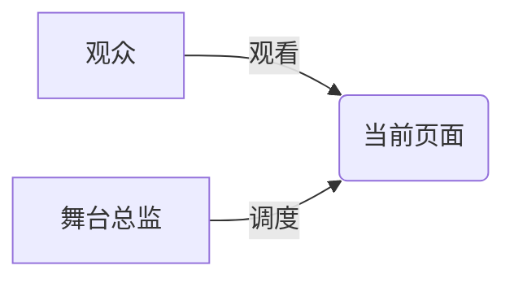
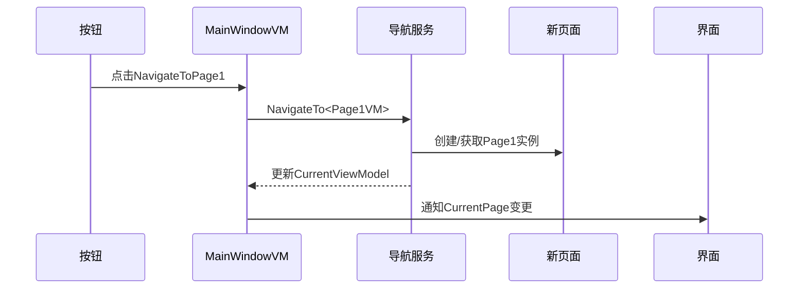

# Chapter 3: 主窗口视图模型

欢迎回到我们的Avalonia之旅！在上一章我们认识了魔法工具箱——[依赖注入容器](02_依赖注入容器_.md)，现在让我们来认识应用中的"交通指挥官"：主窗口视图模型！

## 为什么需要主窗口视图模型？

想象你正在看一场音乐会 🎵：

- **观众视角**：欣赏主舞台不断变化的精彩表演
- **后台视角**：舞台总监在幕后协调演员上下场



主窗口视图模型就是那位"舞台总监"，它需要：
1. 跟踪当前显示的页面（主舞台）
2. 处理导航按钮点击（演员调度指令）
3. 确保页面切换流畅（无缝转场）

## 核心功能拆解

### 1. 当前页面管理
就像电视遥控器的"当前频道"显示：
```csharp
[ObservableProperty] 
private ViewModelBase currentPage; // 当前显示的页面VM
```

> 💡 注解：`[ObservableProperty]`会自动生成属性变更通知，界面会实时更新

### 2. 导航服务协同
通过[依赖注入容器](02_依赖注入容器_.md)获取导航服务：
```csharp
private readonly INavigationService _navigationService;

public MainWindowViewModel(INavigationService navigationService)
{
    _navigationService = navigationService;
    CurrentPage = _navigationService.CurrentViewModel; // 初始化当前页
}
```

### 3. 导航响应
处理按钮点击的导航指令：
```csharp
[RelayCommand]
private void NavigateToPage1()
{
    _navigationService.NavigateTo<Page1ViewModel>(); // 切换到页面1
}
```

> 🎯 小知识：`[RelayCommand]`会将方法自动转换为可绑定命令

## 传统方式 vs 现代方式

两段代码对比展示进化：

```csharp
// 传统方式：直接创建新实例
CurrentPage = new Page1ViewModel(); 
```
- ❌ 紧耦合
- ❌ 难以测试
- ❌ 无法共享状态

```csharp
// 现代方式：通过导航服务
_navigationService.NavigateTo<Page1ViewModel>();
```
- ✅ 解耦
- ✅ 可测试
- ✅ 状态维护

## 内部工作机制

当点击导航按钮时：



## 实战技巧：属性变更订阅

确保能实时响应导航服务的变化：
```csharp
// 在构造函数中添加：
((NavigationService)_navigationService).PropertyChanged += (_, args) =>
{
    if (args.PropertyName == nameof(INavigationService.CurrentViewModel))
    {
        CurrentPage = _navigationService.CurrentViewModel; // 同步更新
    }
};
```

> 🔍 工作原理：当导航服务的CurrentViewModel变化时，自动更新本地CurrentPage

## 总结与预告

今天我们学到了：
- 主窗口VM的指挥官角色 🎖️
- 如何管理当前页面状态 🖼️
- 导航命令的优雅实现 🧭
- 属性变更的联动技巧 ⛓️

接下来要探索的是：[页面内容控件](04_页面内容控件_.md)——它就像舞台上的可替换背景板，让我们看看如何灵活切换各种内容视图！

---

Generated by [AI Codebase Knowledge Builder](https://github.com/The-Pocket/Tutorial-Codebase-Knowledge)