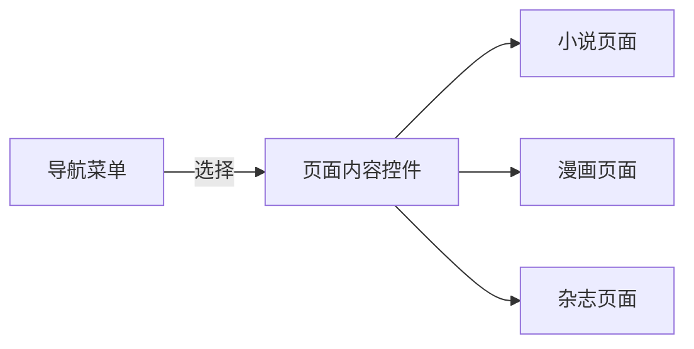
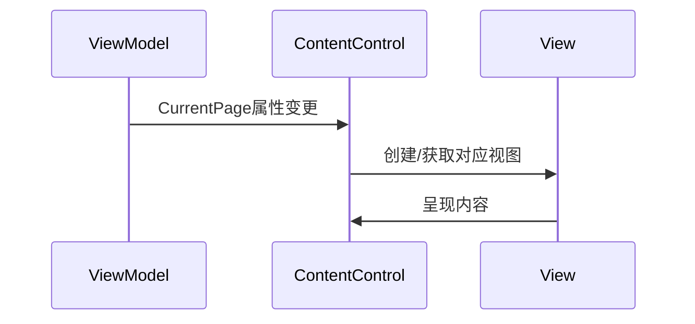

# Chapter 4: 页面内容控件

在[主窗口视图模型](03_主窗口视图模型_.md)章节中，我们认识了负责协调页面的"舞台总监"。现在让我们来看看真正的"舞台"本身——页面内容控件！

## 什么是页面内容控件？

想象你的电脑桌面是一个画框🖼️：

- **画框本身**始终不变（内容控件）
- **展示内容**随时更换（不同页面）

这就是`ContentControl`的作用！它就像一个魔法镜框，能根据绑定的数据自动切换显示不同内容。

## 基础使用场景

假设我们有个简单的阅读器应用：



### 基本XAML结构
观察主窗口中的核心部分：
```xml
<!-- MainWindow.axaml -->
<ContentControl 
    Content="{Binding CurrentPage}" 
    Margin="20"/>
```

> 💡 这个控件会：
> 1. 监听`CurrentPage`属性的变化
> 2. 自动加载对应的视图
> 3. 完美适应容器尺寸

## 工作原理详解

当页面切换发生时：



### 关键点说明：
1. **数据绑定**：通过`Content="{Binding CurrentPage}"`建立连接
2. **自动转换**：当`CurrentPage`是ViewModel时，会自动找到对应的View
3. **内容更新**：无需手动操作DOM，全自动完成

## 与传统方式的对比

```csharp
// 传统硬编码方式（不推荐）
if (page == "Page1")
{
    contentArea.Child = new Page1View();
}
else if (page == "Page2")
{
    contentArea.Child = new Page2View();
}
```
缺点：
- ❌ 大量条件判断
- ❌ 紧耦合
- ❌ 难以维护

```xml
<!-- 现代数据驱动方式 -->
<ContentControl Content="{Binding CurrentPage}"/>
```
优势：
- ✅ 自动响应变化
- ✅ 解耦视图逻辑
- ✅ 便于单元测试

## 实战技巧

### 1. 自定义内容模板
如果想控制如何渲染ViewModel：

```xml
<ContentControl Content="{Binding CurrentPage}">
    <ContentControl.ContentTemplate>
        <DataTemplate>
            <Border Background="LightBlue" Padding="10">
                <ContentPresenter/> <!-- 这里是实际内容 -->
            </Border>
        </DataTemplate>
    </ContentControl.ContentTemplate>
</ContentControl>
```

### 2. 过渡动画
添加页面切换动画效果：

```xml
<ContentControl Content="{Binding CurrentPage}">
    <ContentControl.Styles>
        <Style Selector="ContentControl">
            <Setter Property="RenderTransform">
                <TransformGroup>
                    <TranslateTransform X="0" Y="0"/>
                </TransformGroup>
            </Setter>
            <Style.Animations>
                <Animation Duration="0:0:0.3" 
                          FillMode="Forward">
                    <KeyFrame Cue="0%">
                        <Setter Property="Opacity" Value="0"/>
                        <Setter Property="RenderTransform.X" Value="20"/>
                    </KeyFrame>
                    <KeyFrame Cue="100%">
                        <Setter Property="Opacity" Value="1"/>
                        <Setter Property="RenderTransform.X" Value="0"/>
                    </KeyFrame>
                </Animation>
            </Style.Animations>
        </Style>
    </ContentControl.Styles>
</ContentControl>
```

> 🌟 效果：新页面会从右侧淡入，创建优雅的过渡效果

## 常见问题排查

**问题**：页面切换后内容不更新  
✅ 检查项：
1. ViewModel是否实现了`INotifyPropertyChanged`
2. 绑定是否正确 `Content="{Binding CurrentPage}"`
3. [导航服务](05_导航服务_.md)是否正确触发属性变更

**问题**：显示类型名称而不是内容  
✅ 解决方案：
1. 确保已注册View和ViewModel的对应关系
2. 检查[视图定位器](07_视图定位器_.md)是否工作正常

## 总结与展望

今天我们深入了解了：
- 内容控件的画框哲学 🖼️
- 数据绑定的自动化魔力 ✨
- 页面切换的动画技巧 🎬
- 常见问题的解决方法 🛠️

在下一章中，我们将认识幕后的导航指挥家：[导航服务](05_导航服务_.md)，了解如何优雅地在不同页面间进行路由跳转！

---

Generated by [AI Codebase Knowledge Builder](https://github.com/The-Pocket/Tutorial-Codebase-Knowledge)