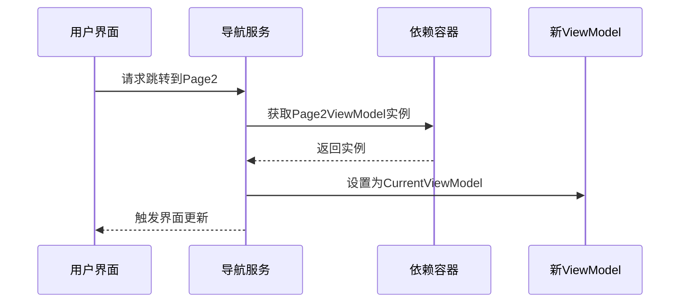

# Chapter 5: 导航服务

在上一章我们了解了[页面内容控件](04_页面内容控件_.md)如何像魔法画框一样展示不同内容，现在让我们认识背后的"GPS系统"——导航服务，它将成为你在应用页面间穿梭的智能向导！

## 为什么需要导航服务？

想象你在驾驶一辆汽车 🚗：

- **没有导航**：你需要记路标、查地图，手忙脚乱
- **使用导航**：只需告诉它目的地，就会自动规划路线

导航服务就是应用程序中的这个"智能导航系统"，它能：
1. 记住当前所在页面（当前位置）
2. 接收目标页面指令（目的地）
3. 自动完成页面切换（规划路线）

## 核心功能解析

### 1. 当前页面记录
就像GPS会显示"当前在XX路"：
```csharp
[ObservableProperty]
private ViewModelBase _currentViewModel; // 跟踪当前显示的ViewModel
```

> 💡 技术点：`[ObservableProperty]`会让属性变更自动通知UI更新

### 2. 页面切换功能
调用导航就像对出租车司机说"去机场"：
```csharp
public void NavigateTo<T>() where T : ViewModelBase
{
    var viewModel = _serviceProvider.GetRequiredService<T>(); // 获取目标VM
    CurrentViewModel = viewModel; // 更新当前页
}
```

### 3. 依赖注入集成
通过构造函数获取服务容器：
```csharp
public NavigationService(IServiceProvider serviceProvider)
{
    _serviceProvider = serviceProvider;
    NavigateTo<Page1ViewModel>(); // 默认显示首页
}
```

## 工作原理图解

当调用`NavigateTo`时的内部流程：



## 实战演练

### 1. 基本使用
从主窗口ViewModel调用导航：
```csharp
[RelayCommand]
private void GoToSettings()
{
    _navigationService.NavigateTo<SettingsViewModel>();
}
```

### 2. 带参数导航
如果需要传递参数（进阶用法）：
```csharp
// 在导航服务中添加方法
public void NavigateWithData<T>(object data) where T : ViewModelBase
{
    var vm = _serviceProvider.GetRequiredService<T>();
    if (vm is IRecipient recipient) 
    {
        recipient.ReceiveData(data); // 假设ViewModel实现了数据接收接口
    }
    CurrentViewModel = vm;
}
```

## 与传统方式对比

**旧方式**：直接创建页面实例
```csharp
// 问题：紧耦合、难测试、状态易丢失
MainFrame.Content = new Page2();
```

**现代方式**：通过导航服务
```csharp
// 优点：松耦合、易测试、状态集中管理
_navigationService.NavigateTo<Page2ViewModel>();
```

## 常见问题解答

**Q**：页面切换没反应怎么办？  
✅ 检查步骤：
1. 确认ViewModel已注册到依赖容器
2. 检查`CurrentViewModel`是否实现了`INotifyPropertyChanged`
3. 确保[主窗口视图模型](03_主窗口视图模型_.md)正确订阅了变更事件

**Q**：如何在页面间传递数据？  
方案1：通过共享服务（推荐）  
方案2：扩展导航服务支持参数（如上文示例）

## 总结与展望

今天我们掌握了：
- 导航服务的GPS式工作原理 🗺️
- 页面跳转的现代化实现 🚀
- 依赖注入的完美配合 ⚙️
- 常见问题的解决方案 🛠️

接下来我们将学习[页面视图模型基类](06_页面视图模型基类_.md)，它是所有页面的"基因蓝图"，让我们看看如何打造标准化的页面结构！

---

Generated by [AI Codebase Knowledge Builder](https://github.com/The-Pocket/Tutorial-Codebase-Knowledge)