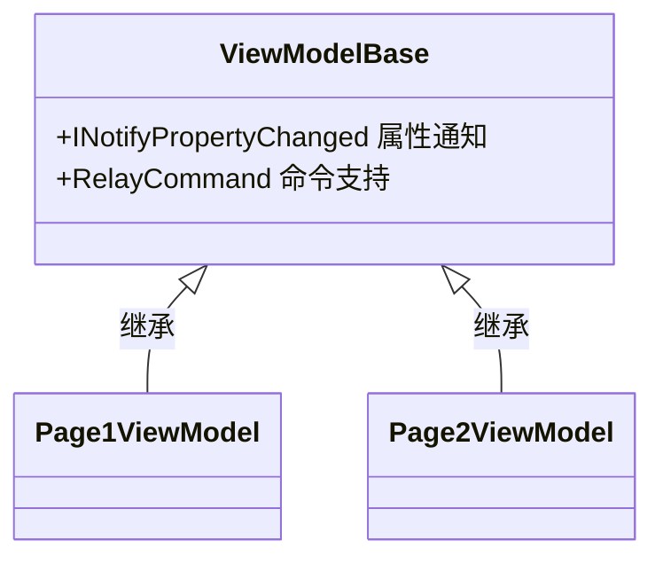
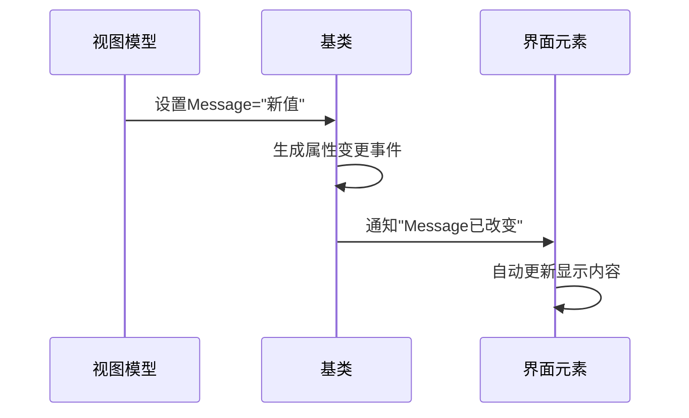

# Chapter 6: 页面视图模型基类

在上一章我们认识了智能向导——[导航服务](05_导航服务_.md)，现在让我们来探索所有页面背后的"基因密码"：页面视图模型基类！就像人类都有相似的DNA结构，我们的页面也需要共同的基础功能。

## 为什么需要基类？

想象你是一个电器设计师 💡：

- 所有电器都需要**电源接口**（共同功能）
- 但电饭煲、电视、冰箱又有**各自特性**（特有功能）

`ViewModelBase`就是这个标准的"电源接口"：


## 核心功能解析

### 1. 属性变更通知
让界面自动响应数据变化，就像温度计🌡️：
```csharp
// 在基类中已内置
public class ViewModelBase : ObservableObject
{
    // 提供自动通知能力
}
```

使用示例：
```csharp
public partial class Page1ViewModel : ViewModelBase
{
    [ObservableProperty] 
    private string _message = "你好！"; // 修改时会自动通知UI
}
```

### 2. 命令处理
把按钮点击变成"魔法开关"🔘：
```csharp
[RelayCommand]
private void SayHello()
{
    Message = "按钮被点击了！";
}
```

## 传统方式 vs 现代方式

**旧方式**：手动实现接口
```csharp
// 需要实现INotifyPropertyChanged等接口
// 每个属性都要写通知代码
```

**现代方式**：继承基类
```csharp
// Page1ViewModel.cs
public partial class Page1ViewModel : ViewModelBase
{
    [ObservableProperty]
    private bool _isActive; // 一行代码搞定！
}
```

优势对比：
- ✅ 代码量减少80%
- ✅ 自动生成优化代码
- ✅ 统一维护基础功能

## 内部工作机制

当属性发生变化时：



## 实战技巧

### 1. 自动命令生成
原来需要这样写命令：
```csharp
private ICommand _clickCommand;
public ICommand ClickCommand => _clickCommand ??= new RelayCommand(OnClick);

private void OnClick()
{
    // 处理逻辑
}
```

现在只需：
```csharp
[RelayCommand]
private void Click()
{
    // 处理逻辑
}
```

### 2. 调试小技巧
查看生成的代码：
1. 编译项目
2. 在解决方案资源管理器开启"显示所有文件"
3. 展开obj/Debug/netX.0目录
4. 找到`*.g.cs`文件

## 常见问题解答

**Q**：为什么我的属性变更没有触发界面更新？
✅ 检查项：
1. 是否正确继承`ViewModelBase`
2. 是否使用`[ObservableProperty]`特性
3. 属性是否为`private`字段（要求格式）

**Q**：命令不执行怎么办？
✅ 解决方案：
1. 确认方法标记了`[RelayCommand]`
2. 检查XAML绑定语法：`Command="{Binding ClickCommand}"`

## 总结与展望

今天我们解锁了：
- 基类如何作为"标准电源接口"⚡
- 属性通知的自动化魔法 ✨
- 命令处理的极简写法 🎯
- 问题排查的方法指南 🔍

接下来我们要认识页面与视图的"红娘"：[视图定位器](07_视图定位器_.md)，它将帮助View和ViewModel自动配对！

---

Generated by [AI Codebase Knowledge Builder](https://github.com/The-Pocket/Tutorial-Codebase-Knowledge)