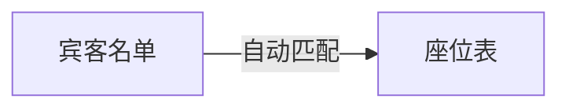
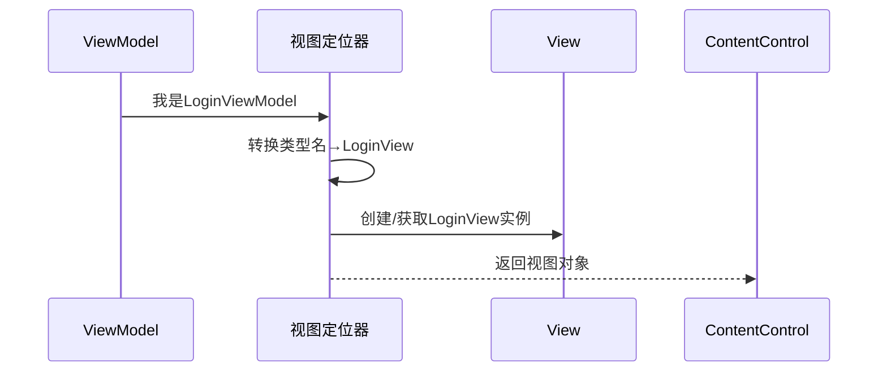

# Chapter 7: 视图定位器

在上一章学习了[页面视图模型基类](06_页面视图模型基类_.md)后，我们知道如何构建标准的页面逻辑。现在我们来认识一位神奇的"红娘"——视图定位器，它能自动为ViewModel找到配对View，就像相亲软件能帮你匹配最合适的对象！👩💼👨💼

## 为什么需要视图定位器？

假设你举办一场高端晚宴 🍽️：

- **传统方式**：需要人工核对宾客名单和座位表
- **现代方式**：使用电子引导系统，自动显示来宾对应的座位



视图定位器就是应用程序中的电子引导系统，它自动完成：
1. 根据ViewModel类型找到对应View类型
2. 创建或获取View实例
3. 建立两者关联关系

## 核心理念：命名约定

就像酒店根据"房号+姓名"来分配房间：

```csharp
// View寻找规则示例：
LoginViewModel → LoginView
SettingsViewModel → SettingsView
```

> 💡 规律：把"ViewModel"替换为"View"即可找到对应视图

## 基础使用方式

### 1. 注册视图定位器
在`App.axaml.cs`中配置：

```csharp
public override void Initialize()
{
    AvaloniaXamlLoader.Load(this);
    DataTemplates.Add(new ViewLocator()); // 添加自动匹配规则
}
```

### 2. 自动绑定示例
当设置`ContentControl`的`Content`属性时：

```xml
<ContentControl Content="{Binding CurrentViewModel}"/>
```

会自动触发视图定位器为当前ViewModel找到对应View！

## 工作原理图解

视图定位器的匹配流程：



## 两种实现方式对比

### 1. 简单实现（无依赖注入）
```csharp
public Control? Build(object? param)
{
    var viewName = param.GetType().FullName!.Replace("ViewModel", "View");
    var viewType = Type.GetType(viewName);
    return (Control)Activator.CreateInstance(viewType)!; // 直接创建实例
}
```

### 2. 依赖注入版本（推荐）
```csharp
public Control? Build(object? param)
{
    var viewName = param.GetType().FullName!.Replace("ViewModel", "View");
    var viewType = Type.GetType(viewName);
    
    // 优先从容器获取
    var view = ServiceProvider.GetService(viewType) as Control;
    return view ?? Activator.CreateInstance(viewType) as Control; // 容器无则新建
}
```

> 🌟 优势：能与[依赖注入容器](02_依赖注入容器_.md)无缝集成

## 实战技巧

### 1. 自定义命名规则
如果需要特殊命名规则：

```csharp
var viewName = "SpecialPrefix." + param.GetType().Name.Replace("VM", "View");
```

### 2. 视图预热
提前注册常用视图到容器：

```csharp
services.AddSingleton<LoginView>();
services.AddTransient<SettingsView>();
```

## 常见问题解答

**Q**：为什么显示"Not Found"而不是视图？  
✅ 检查步骤：
1. 确认ViewModel和View命名符合约定
2. 检查View类是否在正确命名空间
3. 确保视图定位器已注册到`DataTemplates`

**Q**：如何调试匹配过程？  
✅ 解决方案：在`Build`方法中添加日志：

```csharp
Console.WriteLine($"尝试匹配：{param.GetType()} → {viewName}");
```

## 总结与展望

今天我们掌握了：
- 视图定位器的红娘式匹配机制 💕
- 命名约定的自动化规则 📝
- 依赖注入的优雅集成 ⚡
- 故障排查的技巧指南 🛠️

接下来我们将探索[主题管理系统](08_主题管理系统_.md)，为应用程序换上美丽的"皮肤"，让界面焕然一新！

---

Generated by [AI Codebase Knowledge Builder](https://github.com/The-Pocket/Tutorial-Codebase-Knowledge)