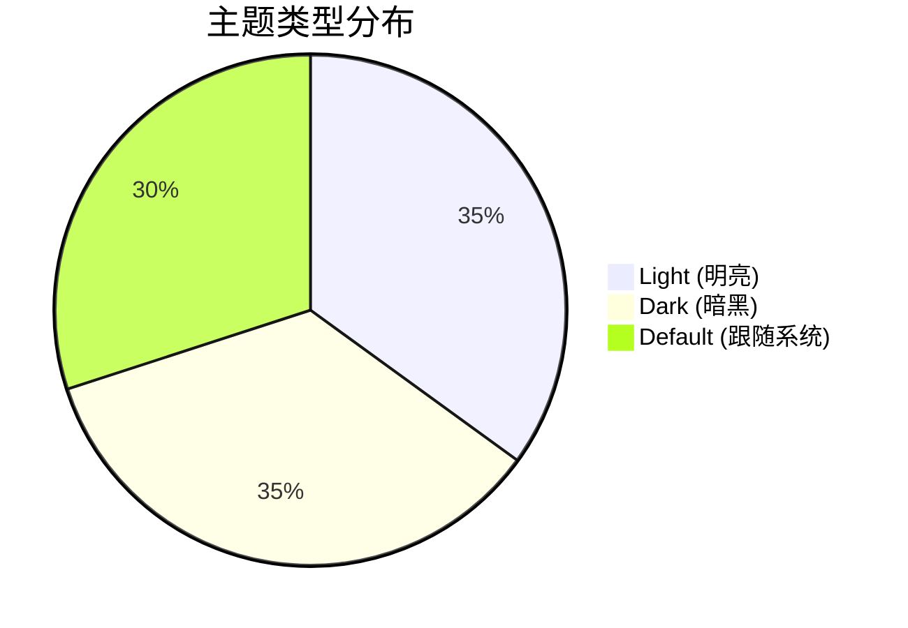
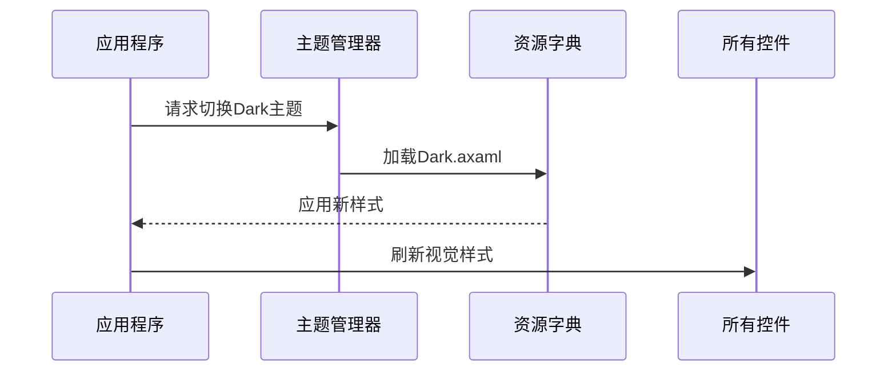

# Chapter 8: 主题管理系统

在[视图定位器](07_视图定位器_.md)章节中，我们学会了如何让View和ViewModel自动配对。现在，我们要为应用程序准备一个"时尚衣橱"——主题管理系统，让你的应用可以像变色龙一样随心切换外观！🦎

## 为什么需要主题管理？

想象你的手机有不同的主题模式：
- 🌞 白天用明亮模式（护眼）
- 🌙 晚上用深色模式（省电）
- 🎨 周末用彩虹模式（个性）

主题管理系统就是这样一个智能开关，它能：
1. 一键切换整套UI配色
2. 自动跟随系统主题变化
3. 自定义独特视觉风格

## 主题基础概念

### 1. 主题类型
Avalonia内置三种基本模式：


### 2. 主题文件结构
主题资源通常这样组织：
```
/Styles
   /Themes
      Light.axaml   # 明亮主题
      Dark.axaml    # 暗黑主题
      Custom.axaml  # 自定义主题
```

## 基础使用方式

### 1. 注册主题
在`App.axaml`中配置默认主题：
```xml
<Application.Styles>
    <FluentTheme />  <!-- 使用Fluent设计风格 -->
</Application.Styles>
```

### 2. 切换主题
通过代码改变当前主题：
```csharp
Application.Current.RequestedThemeVariant = ThemeVariant.Dark;
```

> 💡 小技巧：`ThemeVariant.Default`会让应用跟随系统设置

## 工作原理图解

主题切换的内部流程：



## 实战技巧

### 1. 自定义主题
创建`CustomTheme.axaml`：
```xml
<Styles xmlns="https://github.com/avaloniaui">
    <!-- 覆盖默认颜色 -->
    <Color x:Key="SystemAccentColor">#FF6A1B9A</Color>
    <Style Selector="Button">
        <Setter Property="Background" Value="{DynamicResource SystemAccentColor}"/>
    </Style>
</Styles>
```
然后在代码中加载：
```csharp
var customTheme = new StyleInclude(new Uri("avares://MyApp"))
{
    Source = new Uri("avares://MyApp/Styles/Themes/Custom.axaml")
};
Application.Current.Styles[0] = customTheme;
```

### 2. 动态切换示例
创建主题切换服务：
```csharp
public class ThemeService
{
    public void SwitchTheme(string themeName)
    {
        var theme = themeName switch
        {
            "Light" => ThemeVariant.Light,
            "Dark" => ThemeVariant.Dark,
            _ => ThemeVariant.Default
        };
        
        Application.Current.RequestedThemeVariant = theme;
    }
}
```

## 与传统方式对比

**旧方式**：手动修改每个控件样式
```csharp
// 麻烦且容易遗漏
button.Background = Brushes.Black;
textBox.Foreground = Brushes.White;
```

**现代方式**：通过主题系统
```xml
<!-- 一次定义，全局生效 -->
<Style Selector="Button">
    <Setter Property="Background" Value="{DynamicResource ThemeBackgroundBrush}"/>
</Style>
```
优势：
- ✅ 一键切换所有控件
- ✅ 维护成本低
- ✅ 支持动态响应

## 常见问题解答

**Q**：主题切换后部分控件没更新？
✅ 检查项：
1. 是否使用了`DynamicResource`而非`StaticResource`
2. 控件样式是否有更高优先级的局部设置

**Q**：如何添加新的主题颜色？
✅ 解决方案：
1. 在主题文件中定义颜色资源
2. 使用`{DynamicResource KeyName}`引用

## 总结与展望

今天我们掌握了：
- 主题管理的时尚衣橱理念 👗
- 内置主题的三种基本模式 🌓
- 自定义主题的开发技巧 🎨
- 动态切换的实现方法 🔄

本教程到此已覆盖所有核心概念！现在你已经拥有打造现代化Avalonia应用的全套工具，快去创建你的杰作吧！

> 🌟 终极建议：结合[依赖注入容器](02_依赖注入容器_.md)注册主题服务，享受更优雅的架构体验！

---

Generated by [AI Codebase Knowledge Builder](https://github.com/The-Pocket/Tutorial-Codebase-Knowledge)