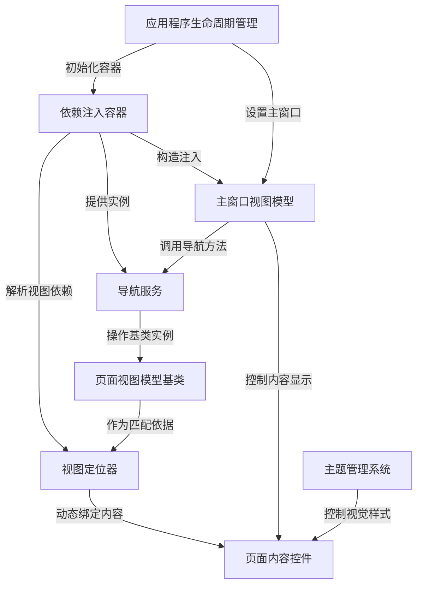

# Tutorial: Avalonia_With_Dependency_Injection_Example

这是一个展示 **Avalonia UI框架** 如何结合 **依赖注入(DI)** 开发的示例项目。它实现了:
- *模块化页面导航*：通过**导航服务**动态切换视图
- *自动视图解析*：通过**视图定位器**将ViewModel与View自动匹配
- *集中管理依赖*：使用**DI容器**统一创建和维护服务实例
主要演示了MVVM模式下如何解耦界面逻辑与业务逻辑。

**Source Repository:** [https://github.com/Ming-jiayou/Avalonia_With_Dependency_Injection_Example](https://github.com/Ming-jiayou/Avalonia_With_Dependency_Injection_Example)

## Chapters

1. [应用程序生命周期管理
](01_应用程序生命周期管理_.md)
2. [依赖注入容器
](02_依赖注入容器_.md)
3. [主窗口视图模型
](03_主窗口视图模型_.md)
4. [页面内容控件
](04_页面内容控件_.md)
5. [导航服务
](05_导航服务_.md)
6. [页面视图模型基类
](06_页面视图模型基类_.md)
7. [视图定位器
](07_视图定位器_.md)
8. [主题管理系统
](08_主题管理系统_.md)

---

Generated by [AI Codebase Knowledge Builder](https://github.com/The-Pocket/Tutorial-Codebase-Knowledge)